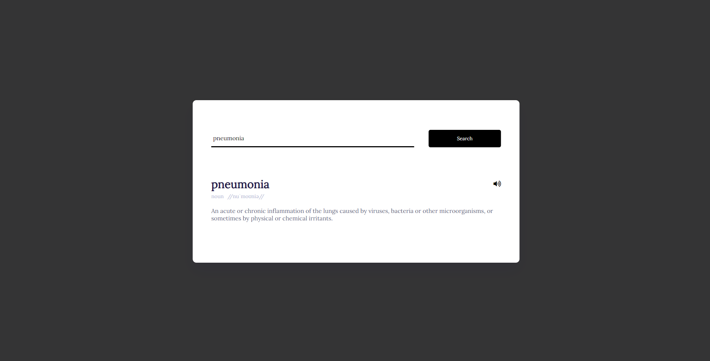

**Dictionary App**

A simple and elegant dictionary web application built using HTML, CSS, and JavaScript. The app allows users to search for word meanings and pronunciations using the [Dictionary API](https://api.dictionaryapi.dev/api/v2/entries/en/). It features a clean user interface with a search box, word details display, and pronunciation audio playback.

**[View Live Demo](https://shinaylim.github.io/Weather-App/)**

**Features:**
- Live word search with real-time results.
- Display of word meanings, parts of speech, and pronunciation.
- Pronunciation audio playback for the searched word.
- Responsive design for seamless usage on different devices.

**Instructions:**
1. Type the word in the search box.
2. Click the "Search" button or press Enter to get the word details.
3. The app will display the word's definition, part of speech, and pronunciation (if available).
4. Click the volume icon to hear the word pronunciation.

**How to Run:**
1. Clone or download the repository.
2. Open `index.html` in your web browser.
3. Start searching for words and expanding your vocabulary!

Feel free to use, modify, and contribute to this project. Feedback and suggestions are always welcome. Happy learning and exploring new words! 📚🔍🗣️

**Credits:**
- [Font Awesome](https://fontawesome.com/) for the beautiful icons.
- [Google Fonts](https://fonts.google.com/) for the Lora and Poppins fonts.

For more details, please check the project source code in the [`script.js`](script.js) and [`style.css`](style.css) files.
